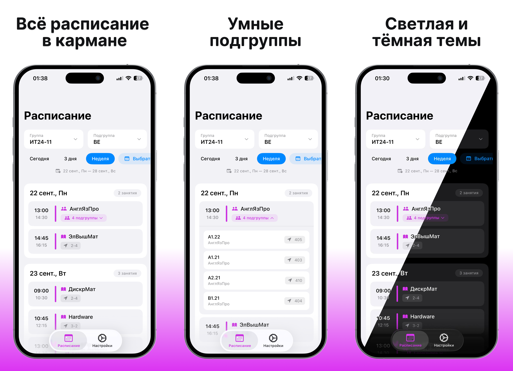

# 📱 МойКЦТ

> Мобильное приложение для студентов Колледжа Цифровых Технологий

## 📸 Скриншоты

  

## ✨ Возможности

- 📅 **Просмотр расписания** — актуальное расписание занятий на сегодня, 3 дня или всю неделю
- 🎯 **Персонализация** — выбор группы и подгруппы для отображения вашего расписания
- 📆 **Гибкий выбор дат** — просмотр расписания за произвольный период
- 🌓 **Темы оформления** — светлая, тёмная тема и автоматическое переключение по системной теме
- 🧩 **Виджеты** — быстрый доступ к расписанию прямо с главного экрана iPhone

## 🛠 Технологии

Приложение построено на современном стеке iOS-разработки:

- **Язык:** Swift 6
- **UI:** SwiftUI
- **Архитектура:** MVVM (Model-View-ViewModel)
- **Сетевое взаимодействие:** Alamofire

## 📋 Требования

- iOS 17.1 или выше

## 🚀 Установка

### Скачать готовое приложение из App Store

## 🤝 Вклад в проект

Приветствуются любые предложения по улучшению приложения!

## 📄 Лицензия

Этот проект разработан для студентов Колледжа Цифровых Технологий.

---

  Сделано с ❤️ для студентов КЦТ

